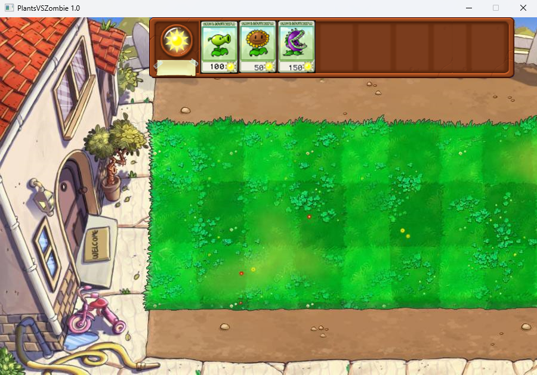

# PlantsVSZombies

我承认了我就是做不到用纯C开发PlantsVSZombies (

# 开发环境

> [!NOTE]\
> Visual Studio 2017 Community\
> [EasyX 2024](https://easyx.cn/)

# 已实现功能

草地 植物卡片 拖放种植 植物晃动

# 截图

# 参考教程

[【程序员Rock】C语言项目：完整版植物大战僵尸！可能是B站最好的植物大战僵尸教程了！零基础手把手游戏开发
](https://www.bilibili.com/video/BV1vM4y1X7Kb)
[pvz-Simple-version-C-](https://github.com/ammoniacrow/pvz-Simple-version-C-)